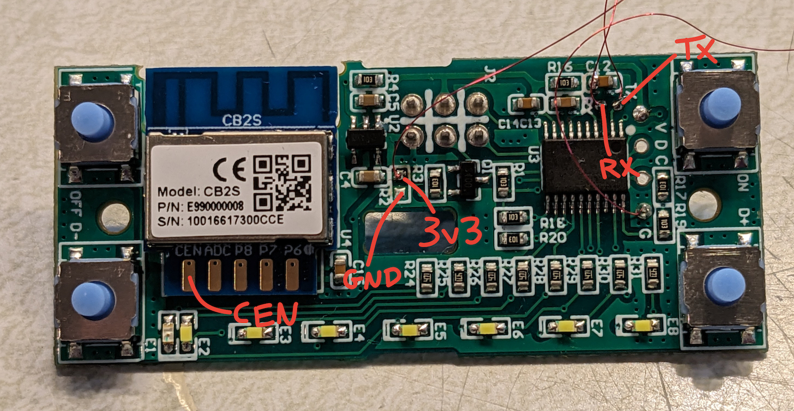
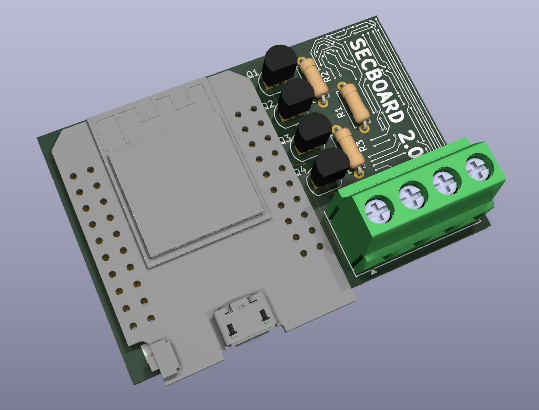

# ESPHome Device Setup

These scripts and configuration contain the main configuration and
components for various ESPHome devices.  When flashed on to a device,
they can be given WiFi credentials through a captive portal, and
adopted into ESPHome dashboard automatically.

## Using a device once it's flashed or factory-reset

- Power on device
- Connect to the AP created by the device
- Visit 192.168.4.1 and configure WiFi credentials
- Visit ESPHome and adopt the device

**NOTE**: The way the `dashboard_import` mechanism sets up the
per-device YAML file in esphome mostly works, but it sets up a
`package:` line that ends up using the default refresh value of "1d".
If you want to ensure you're pulling changes from git faster,
edit the esphome config from

```
packages:
  jim.elegrp-dpr10: github://jimparis/esphome-cfg/elegrp.yaml@main
```
to
```
packages:
  jim.elegrp-dpr10
    url: https://github.com/jimparis/esphome-cfg
    file: elegrp.yaml
    refresh: 0s
```

## Misc ESP based modules (Gosund, Treatlife, BN-Link)

### Build .bin for flashing via existing Tasmota:

    make build-gosund-dimmer

### Flash via serial

    make flash-gosund-dimmer TARGET=/dev/ttyUSB0

This maintains WiFi config.  If you want to erase it to get back to a
fresh provisioned state, erase first:

    pipenv run esptool.py --chip esp8266 -p /dev/ttyUSB0 erase_flash

### Flash via OTA over existing esphome firmware

    make flash-gosund-dimmer TARGET=gosund-dimmer-aabbcc.local


## ELEGRP DPR10 Dimmer Switch

This has a BK7231N module (not ESP32 or ESP8266), but there's support
in ESPHome for it through LibreTiny.

Unfortunately the firmware it was delivered with is too new to be
reflashed OTA with either tuya-convert or tuya-cloudcutter, so it
needs to be opened and flashed via serial.

### Hardware connections

Remove screws on the back.

Connect a Micro1v8 or MicroFTX configured for 3.3V as follows:



    Micro1v8    DPR10
    GND         GND (G hole near Tuya MCU)
    OUT         TX (TX test point near Tuya MCU)
    IN          RX (RX test point near Tuya MCU)
    V           Tap onto 3.3V rail that goes into Wifi module

### Firmware

#### Kickstart

Get [kickstart-bk7231n-2025-05-28.uf2](https://github.com/libretiny-eu/esphome-kickstart/releases/download/v25.05.28/kickstart-bk7231n-2025-05-28.uf2)
from https://github.com/libretiny-eu/esphome-kickstart/releases/tag/v25.05.28

Flash with

    uv run --with ltchiptool,wxpython,zeroconf ltchiptool flash write -d /dev/serial/by-id/... kickstart-bk7231n-2025-05-28.uf2

Right after running that command, briefly touch GND to the exposed CEN finger on the Wifi module

After flashing, you should see a "kickstart-bk7231n" WiFI appear.
Connect, and configure it to connect to BACONHOME

#### OTA FW

Flash via esphome (through esphome OTA API) with e.g.:

    make flash-elegrp TARGET=kickstart-bk7231n.home
    make flash-elegrp TARGET=elegrp-dpr10-128b7d.home
    make flash-elegrp TARGET=elegrp-dpr10-128b7d.bacon

#### Debug notes

After build, unencrypted binary is

    .esphome/build/elegrp/.pioenvs/elegrp-dpr10/raw_firmware.bin

See what devices are advertising with

    avahi-browse -r _esphomelib._tcp

Look for `package_import_url` in the `txt` record to make sure
adoption in esphome UI will work.  URL must be 44 chars or less
on bk7231n platform.


## Secboard 2.0 (Vista home security interface)

Using Dan's [Secboard 2.0](https://git.jim.sh/dan/esp32-home-interface)



Connections:

| J1 pin | Color  | Panel        | ESP32                         |
|--------|--------|--------------|-------------------------------|
| 1      | Yellow | ECP Data Out | GPIO22 (rx)                   |
| 2      | Red    | 12V          |                               |
| 3      | Green  | ECP Data In  | GPIO21 (tx), GPIO18 (monitor) |
| 4      | Black  | GND          | GND                           |

Config:

```yaml
  rxpin: 22
  txpin: 21
  monitorpin: 18
  invert_mon: "false"
  invert_tx: "false"
  invert_rx: "false"
  input_mode_rx: INPUT_PULLDOWN
  input_mode_mon: INPUT_PULLUP
```
